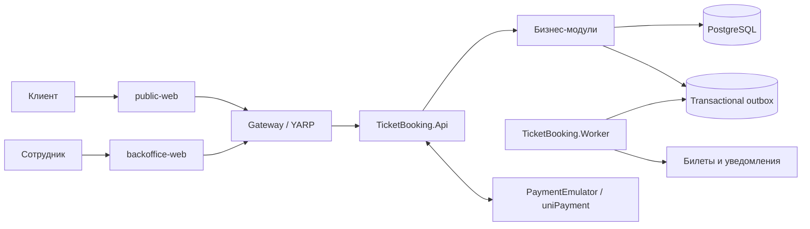

# TicketBooking

> Платформа для бронирования, продажи и управления билетами на мероприятия


TicketBooking создаётся как единая платформа для публикации мероприятий,
конкурентно-безопасного бронирования билетов, приёма платежей и выпуска
электронных билетов. Клиентское и административное React-приложения работают
с модульным монолитом на ASP.NET Core, а .NET Aspire управляет локальным
окружением и наблюдаемостью.

> [!IMPORTANT]
> Проект находится на ранней стадии разработки. Сейчас репозиторий содержит
> рабочий инженерный каркас: Aspire AppHost, минимальный API, два
> Vite-приложения, заготовки backend-модулей и тестовых проектов. Описанные ниже
> бизнес-возможности являются целевым объёмом MVP и реализуются поэтапно.

## Возможности MVP

- отдельная регистрация и авторизация клиентов и сотрудников;
- управление компаниями, мероприятиями, сеансами, тарифами и вместимостью;
- публичный каталог мероприятий и клиентский личный кабинет;
- атомарное резервирование без перепродажи мест при конкурентных запросах;
- жизненный цикл заказа: создание, истечение, отмена, оплата и возврат;
- идемпотентная обработка платёжных уведомлений;
- выпуск электронных билетов через transactional outbox;
- административный аудит без физического изменения истории;
- трассировка, метрики, логи и health checks через OpenTelemetry и Aspire;
- локальный запуск через Aspire и планируемая публикация в Docker Compose.

## Архитектура

Целевая архитектура MVP представляет собой модульный монолит с отдельными
интерфейсами для клиентов и сотрудников. Бизнес-модули изолируются контрактами
и собственными схемами PostgreSQL, а фоновые операции выполняются через Worker
и transactional outbox.



Aspire AppHost в текущей версии запускает следующие ресурсы:

| Ресурс | Назначение | Состояние |
| --- | --- | --- |
| `ticketbooking-api` | ASP.NET Core API с OpenAPI | Базовый шаблон |
| `public-web` | Клиентское React-приложение | Vite-каркас |
| `backoffice-web` | Интерфейс сотрудников | Vite-каркас |
| `Companies` | Контракты и ядро первого бизнес-модуля | Заготовка |
| PostgreSQL | Основное хранилище данных | Запланирован |
| Gateway, Worker | Маршрутизация и фоновые задачи | Запланированы |

## Структура проекта

```text
ticket-booking/
├── src/
│   ├── Aspire/                 # AppHost и общие настройки сервисов
│   ├── Backend/                # API, BuildingBlocks и бизнес-модули
│   └── Frontend/
│       ├── public-web/         # Клиентское приложение
│       └── backoffice-web/     # Административное приложение
├── tests/                      # Unit, integration, architecture и system tests
├── docs/                       # Анализ предметной области и план реализации
├── deploy/                     # Будущие артефакты развёртывания
└── TicketBooking.slnx          # Решение .NET
```

## Быстрый старт

### Требования

- [.NET 10 SDK](https://dotnet.microsoft.com/download/dotnet/10.0)
- [Aspire CLI 13.5+](https://aspire.dev/get-started/install-cli/)
- [Node.js](https://nodejs.org/) версии, поддерживаемой Vite 8
- [pnpm 11+](https://pnpm.io/installation)

Проверьте установленные инструменты:

```bash
dotnet --version
aspire --version
node --version
pnpm --version
```

### Установка зависимостей

В корне репозитория восстановите .NET-пакеты и зависимости обоих frontend-приложений:

```bash
dotnet restore TicketBooking.slnx
pnpm --dir src/Frontend/public-web install
pnpm --dir src/Frontend/backoffice-web install
```

### Запуск через Aspire

```bash
cd src/Aspire/TicketBooking.AppHost
aspire start
```

Aspire выведет адрес Dashboard, где доступны состояние ресурсов, логи,
трассировки и актуальные URL приложений. Порты назначаются динамически, поэтому
используйте ссылки из Dashboard.

Остановить окружение можно командой:

```bash
aspire stop
```

> [!NOTE]
> Текущие страницы frontend и endpoint `/weatherforecast` являются шаблонными
> и служат для проверки инженерного каркаса.

## Разработка

### Frontend отдельно

Каждое приложение можно запустить независимо с Vite HMR:

```bash
pnpm --dir src/Frontend/public-web dev
pnpm --dir src/Frontend/backoffice-web dev
```

### Сборка и проверки

```bash
# Backend и проекты решения
dotnet build TicketBooking.slnx

# Текущий набор TUnit-тестов
dotnet run --project tests/TicketBooking.SystemTests --no-build

# Frontend
pnpm --dir src/Frontend/public-web build
pnpm --dir src/Frontend/public-web lint
pnpm --dir src/Frontend/backoffice-web build
pnpm --dir src/Frontend/backoffice-web lint
```

В backend включены nullable reference types, рекомендуемый набор анализаторов,
соблюдение `.editorconfig` и режим warnings as errors. Тестовый контур
использует [TUnit](https://tunit.dev/).

## Документация

- [План реализации MVP](docs/plan.md) — этапы, вертикальные срезы и критерии
  готовности.
- [Анализ системы](docs/system-analysis.md) — роли, процессы, ограничения и
  открытые вопросы.
- [Исходный бизнес-концепт](docs/concepts.md) — предметная область и требования
  заказчика.
- [Высокоуровневый дизайн](docs/high_level_design.md) — функциональная
  декомпозиция целевой системы.
- [Декомпозиция задач](docs/plans/tasks_breakdown.md) — подробный рабочий backlog.

> [!TIP]
> Перед реализацией бизнес-функции сверяйтесь с планом MVP и анализом системы:
> исходный концепт содержит намеренно зафиксированные неоднозначности, которые
> должны разрешаться до написания кода.
